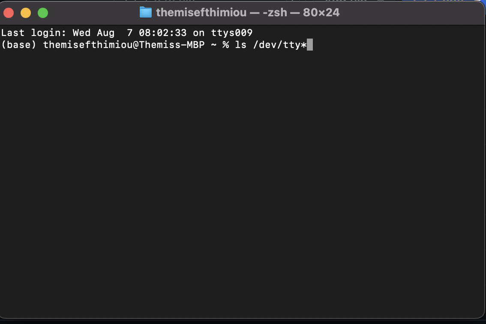
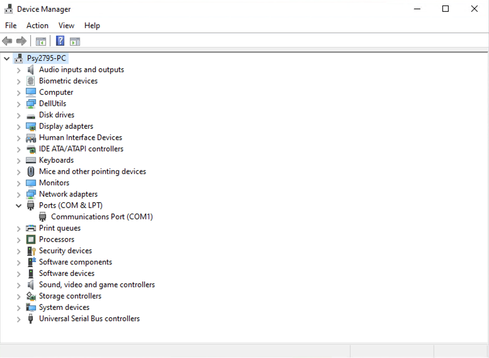
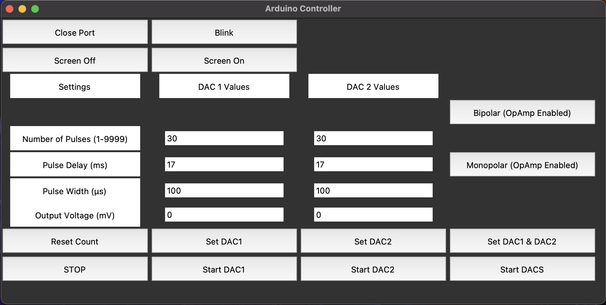
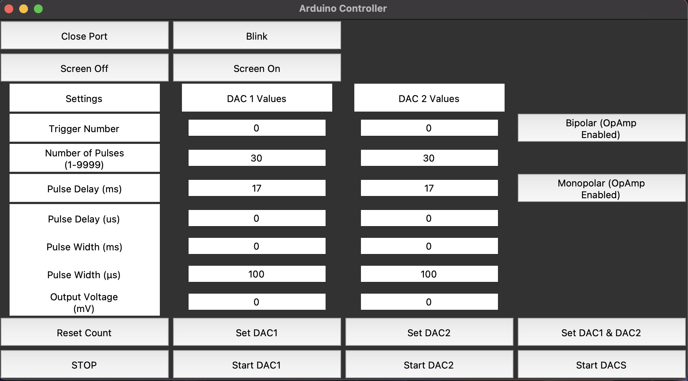
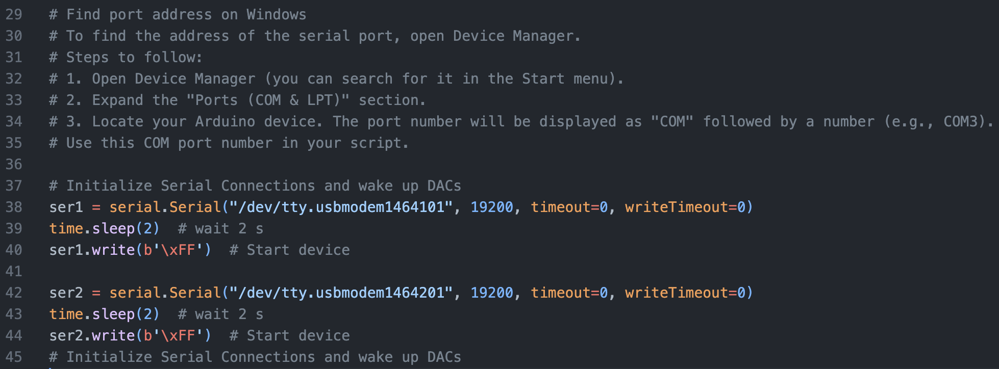

# fNMES-GUI: Computer-controlled Electrical Stimulation of Facial Muscles

This repository contains the Python script for a graphical user interface (GUI) designed to control electrical stimulators via Arduino boards, facilitating precise adjustment of electrical stimulation parameters. This repository accompanies the paper titled: *Computer-controlled electrical stimulation of facial muscles by facial neuromuscular electrical stimulation (fNMES): Hardware and software solutions* published in the Journal of Neuroscience Methods.

## Contents
- [Requirements](#requirements)
- [GUI Functionality](#gui-functionality)
  - [Command Codes](#command-codes)
  - [GUI Commands](#gui-commands)
  - [Button Actions](#button-actions)
  - [Configuration Commands](#configuration-commands)
  - [Additional Details](#additional-details)
- [Getting Started with fNMES-GUI for Beginners](#getting-started-with-fnmes-gui-for-beginners)
  - [Prerequisites](#prerequisites)
  - [Download the Script](#download-the-script)
  - [Running the Script](#running-the-script)
  - [Configure the Port](#configure-the-port)
  - [Running the GUI](#running-the-gui)
- [Arduino .ino Code](#arduino-ino-code)
- [License](#license)

## Requirements

The GUI is developed using Python 3.8.5 and utilizes the `tkinter` package for the interface. Additional Python modules required are:
- `serial`: for sending serial commands to Arduino
- `time`: to incorporate delays in commands using `time.sleep`

Ensure the Arduino is set with a BaudRate of 19200. Connection ports differ based on the operating system:
- **Windows**: Use a ‘COM’ port.
- **Mac OS & Linux**: Use a “/dev/ttyACM0” location.

### Finding Your Port

#### Mac OS & Linux:
1. Open terminal
2. Type: `ls /dev/tty*` and note the port number listed for `/dev/ttyUSB*` or `/dev/ttyACM*`
3. The port number is represented with `*` here.



#### Windows:
1. Open Device Manager (Start → Control Panel → Hardware and Sound → Device Manager)
2. Look under “Ports” to find the matching COM port.
3. Note the number in the bracket behind the port description.



## GUI Functionality

The GUI interfaces with the Arduino by sending Hex commands to trigger specific actions in the firmware (DS5 controlled, built by Andreas Gartus, 2020).

### Command Codes
- **Matlab**: Use decimal codes (e.g., `99` for start)
- **Python**: Use Hex codes without the leading `0` (e.g., `xFF` for start)

### GUI Commands

#### Button Actions
- **Start**: `255 (0xFF)`: Initiates device, sets default settings, and opens the port for commands.
- **Blink**: `99 (0x63)`: Blinks the display as a command test (do not use continuously).
- **Display Off**: `69 (0x45) + 1`: Turns the display off.
- **Display On**: `68 (0x44) + 0`: Turns the display on.
- **Reset Pulse**: `78 (0x4E)`: Resets pulse count to zero.
- **Query Data**: `65 (0x41)`: Displays current settings on Arduino.
- **Set All**: Sends all input parameters to the Arduino.
- **START**: `80 (0x50)`: Begins pulse sequence.
- **STOP**: `33 (0x21)`: Emergency stop for pulse sequence.
- **Close Port**: Closes the serial port. Restart the GUI and Arduino connection if needed.

#### Configuration Commands
- **Bipolar OpAmp Enabled**: `98 (0x62)`: Set pulse mode to bipolar.
- **Monopolar OpAmp Enabled**: `97 (0x61)`: Set pulse mode to monopolar with OpAmp.
- **Monopolar OpAmp Disabled**: `96 (0x60)`: Set pulse mode to monopolar without OpAmp.

### Additional Details
- OpAmp adjustments are necessary for enabling bipolar stimulation.
- Monopolar stimulation can be achieved with either setting of the OpAmp.

## Getting Started with fNMES-GUI for Beginners

To use the fNMES-GUI, you'll need a basic setup and understanding of how to run Python scripts. Here's a step-by-step guide to get you started:

### Prerequisites
Before running the GUI, make sure you have the following:
- **Python Installed**: Install Python 3.8.5 or higher. You can download it from [python.org](https://www.python.org/downloads/).
- **Python Modules**: Ensure the `tkinter`, `serial`, and `time` modules are installed. You can install any required modules using pip. For example:
  ```bash
  pip install pyserial
  ```

### Download the Script
- **From GitHub**: Navigate to the GitHub repository where the fNMES-GUI script is hosted.
  - Click on the `Code` button and select `Download ZIP`, or clone the repository using:
    ```bash
    git clone git@github.com:ThemisEfth/fNMES-Technical-Guide.git
    ```
  - Extract the ZIP file if you downloaded it.

Here is the revised section of the GitHub README that includes the images and a description of the two types of GUIs:

## GUI Types

There are two types of GUIs available: a condensed version and a full version.

### Condensed GUI

The condensed GUI focuses on simplifying the user interface by reducing the number of input fields and emphasizing the use of milliseconds over microseconds for input parameters. This version is recommended for most users due to its simplicity and ease of use.



### Full GUI

The full GUI provides a more comprehensive interface with additional input fields, allowing for more detailed control over the stimulation parameters. This version includes inputs for both milliseconds and microseconds, giving users more flexibility in their settings.



### Choosing the Right GUI

- **Condensed GUI**: Use this version if you prefer a simpler interface with fewer input fields and a focus on using milliseconds for timing parameters.
- **Full GUI**: Choose this version if you need more detailed control over the stimulation parameters and require inputs for both milliseconds and microseconds.

To switch between the GUIs, simply use the corresponding Python script provided in the repository for each version.


### Running the Script
Once you have Python and the script on your local machine, you can run the script using one of the following methods:

#### Using an Integrated Development Environment (IDE)
- Open your preferred IDE (e.g., PyCharm, VSCode).
- Load the script into the IDE.

### Configure the Port
Before running the GUI, you need to configure the script to communicate with the correct Arduino port:
- **Find the Port**:
  - Use the instructions provided in the "Finding Your Port" section above to identify your COM port (Windows) or device path (Mac/Linux).
- **Edit the Script**:
  - Open the Python script in a text editor or IDE.
  - Locate the line of code where the port is specified, which might look something like this:
    ```python
    arduino = serial.Serial('COM3', 19200)
    ```
  - Replace `'COM3'` with the port you identified earlier.
  - Save the changes.



### Running the GUI
After configuring the port, run the script in the IDE.

Alternatively, you can run the Python file in the terminal/command line:

#### Using the Command Line
- Open Command Prompt (Windows) or Terminal (Mac and Linux).
- Navigate to the directory containing the script. For example:
  ```bash
  cd path/to/your/script
  ```
- Run the script by typing:
  ```bash
  python fNMES_GUI.py
  ```

The GUI should launch, allowing you to interact with the Arduino-connected stimulator.

## Arduino .ino Code

The repository also includes the Arduino .ino file, which is essential for the operation of the fNMES system. This firmware enables the Arduino to:

	•	Receive commands from the Python GUI via serial communication.
	•	Generate pulse trains with adjustable parameters such as pulse width, repetition rate, and repetition period.
	•	Support both bipolar and monopolar stimulation modes.
	•	Integrate an external operational amplifier (OpAmp) for enhanced precision and control over the output voltage.

The Arduino firmware is designed to be flexible, allowing researchers to tailor the electrical stimulation parameters to their specific experimental needs. It facilitates the delivery of precise electrical pulses to facial muscles, making it a valuable tool for studying facial feedback effects and their neurological basis.

Loading the .ino Firmware onto Your Arduino

To load the .ino firmware onto your Arduino, follow these steps:

	1.	Install the Arduino IDE:
	•	Download and install the Arduino IDE from the Arduino website.
	2.	Connect Your Arduino:
	•	Connect your Arduino board to your computer using a USB cable.
	3.	Open the .ino File:
	•	Launch the Arduino IDE.
	•	Go to File > Open and navigate to the .ino file included in this repository. Open the file.
	4.	Select Your Board and Port:
	•	Go to Tools > Board and select the appropriate Arduino board (e.g., Arduino Uno).
	•	Go to Tools > Port and select the port that your Arduino is connected to (e.g., COM3 on Windows, /dev/cu.usbmodem146301 on macOS).
	5.	Upload the Firmware:
	•	Click the Upload button (right arrow icon) in the Arduino IDE toolbar. This will compile the code and upload it to your Arduino board.
	•	Ensure the upload is successful by looking for the “Done uploading” message in the IDE.

Once the firmware is successfully uploaded, your Arduino is ready to communicate with the Python GUI and execute the electrical stimulation commands.

DAC Controller Subfolder

The dac_controller subfolder contains the necessary files for building and configuring the DAC (Digital-to-Analog Converter) controller. This includes both the Arduino code and the schematics for assembling the DAC.

Contents of the dac_controller Subfolder

	•	TMR0521_Library.kicad_sym: KiCad symbol library file.
	•	dac_controller.kicad_pcb: KiCad PCB design file.
	•	dac_controller.kicad_prl: KiCad project file.
	•	dac_controller.kicad_pro: KiCad project file.
	•	dac_controller.kicad_sch: KiCad schematic file.
	•	dac_controller.net: KiCad netlist file.
	•	dac_controller_pcb_1.1.pdf: PDF file of the PCB layout.
	•	dac_controller_schematic_1.1.pdf: PDF file of the schematic diagram.
	•	sym-lib-table: Symbol library table file.

These files provide all the necessary information to build the DAC controller, which is used to control the analog output signals for the fNMES system. Below are the details on how to use the provided files to assemble and configure the DAC controller.

Using the DAC Controller Files

	1.	KiCad Design Files:
	•	KiCad Project Files: Open the dac_controller.kicad_pro project file in KiCad to access the full design of the DAC controller.
	•	Schematic File: The dac_controller.kicad_sch file contains the schematic diagram, which shows the circuit design.
	•	PCB Design File: The dac_controller.kicad_pcb file includes the layout of the PCB, which is used to manufacture the physical circuit board.
	2.	PDF Documentation:
	•	Schematic Diagram: The dac_controller_schematic_1.1.pdf file provides a PDF version of the schematic diagram for easy reference.
	•	PCB Layout: The dac_controller_pcb_1.1.pdf file offers a PDF version of the PCB layout, which can be used to understand the physical placement of components on the board.
	3.	Component Library:
	•	Symbol Library: The TMR0521_Library.kicad_sym file contains the symbols for components used in the DAC controller design.
	4.	Netlist:
	•	Netlist File: The dac_controller.net file provides the netlist for the DAC controller, which is used to link the schematic components with the PCB layout.
	5.	Library Table:
	•	Symbol Library Table: The sym-lib-table file helps KiCad locate the component symbols needed for the design.

Building the DAC Controller

Follow these steps to build the DAC controller:

	1.	Open the KiCad Project:
	•	Download and install KiCad from the KiCad website.
	•	Open KiCad and load the dac_controller.kicad_pro project file.
	2.	Review the Schematic:
	•	Open the dac_controller.kicad_sch file in KiCad’s Eeschema tool to review the schematic diagram.
	•	Ensure all components and connections match the design specifications.
	3.	Prepare the PCB Layout:
	•	Open the dac_controller.kicad_pcb file in KiCad’s PCBnew tool to review the PCB layout.
	•	Make any necessary adjustments to the layout before manufacturing.
	4.	Generate Gerber Files:
	•	Generate Gerber files from the PCB layout, which will be used by PCB manufacturers to create the physical board.
	5.	Assemble the PCB:
	•	Once the PCB is manufactured, assemble the components as per the schematic and PCB layout.
	•	Refer to the dac_controller_schematic_1.1.pdf and dac_controller_pcb_1.1.pdf files for guidance.
	6.	Upload the Firmware:
	•	Use the provided Arduino .ino file to program the Arduino microcontroller that interfaces with the DAC controller.

### Key Parameters of fNMES
- **Pulse Phase**: Monophasic (unidirectional) and biphasic (bidirectional) waveforms.
- **Waveform Shape**: Typically, a square wave is used for its effectiveness and comfort.
- **Pulse Width**: The duration of the ion flow, is critical for stimulating facial nerves effectively.
- **Frequency**: Measured in Hz, affects muscle contraction quality and fatigue rate.
- **Stimulation Intensity**: Delivered in milliamperes (mA), influences muscle contraction strength.

The provided Arduino code and hardware schematics enable the integration of these parameters into the fNMES setup, allowing for precise and reproducible facial muscle stimulation in experimental settings.

## License

This project is licensed under the MIT License - see the [LICENSE.md](LICENSE.md) file for details. This license allows you to use, modify, and distribute the software as you see fit.
